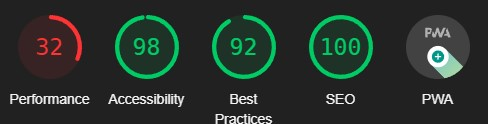
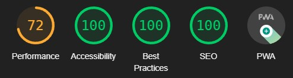
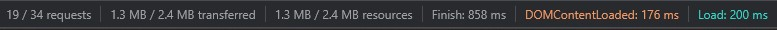
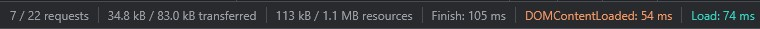

# NativeWAPP

This is a short reimplementation of [https://app.thenativeweb.io/v2/ui](https://app.thenativeweb.io/v2/ui).
It tries to stay close to the original while improving some aspects.

## Compatibillity

This reimplementation uses many modern web features on purpose and might not work everywhere.

## Screenshots

Original (left/top) vs. reimplementation (right/bottom)


## Performance Impact

### Lighthouse

Note: These scores are made with the default "mobile" preset of the Chrome Dev Tools.
The Desktop scores are significantly higher (86 for performance).

#### Original



#### Reimplementation



### Network (excluding images and fonts)

#### Original



#### Reimplementation



### Notes

#### Network / API Access

The API does not set correct CORS headers. For this reasons this page uses [allorigins.win](https://allorigins.win/) as a CORS proxy to load the data from the original API (which is quite fast!). For this reason all API requests made by the reimplementation add about 3KB of data and the content has to be put through `JSON.parse()` twice (once as the response and once for the content). **BUT** this way is still faster, because the original API does not compress data and allorigins.win does. For that reason this only needs to actually download ~24% of the original's data for each API request (there's also some cloudflare caching involved - because of that this normally saves around 100ms per request).

#### Size

The original page uses svelte and the svelte page bundle (_page.svelte-43331ef1.js) is 1.2MB in size itself. Opposing that, this reimplementation uses [Lit](https://lit.dev) and therefore the bundle is only 28.7kb - including the used components.

## Running This

### Building

```npm run build```

### Viewing

Serve the `/build/` folder via any static file server (e.g. `netlify dev`).
